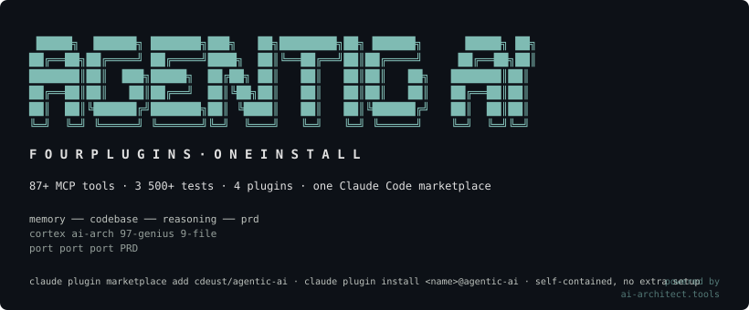

<p align="center">
  
</p>

<p align="center">
  <a href="LICENSE"></a>
  
  
  
  
  
  
  
</p>

<p align="center">
  <a href="#getting-started">Getting Started</a> · <a href="#what-you-get">What You Get</a> · <a href="#how-it-works">How It Works</a> · <a href="#verification">Verification</a> · <a href="#layout">Layout</a> · <a href="#license">License</a>
</p>

<p align="center">
  <strong>This monorepo unifies four projects:</strong><br>
  <a href="https://github.com/cdeust/Cortex">Cortex</a> — persistent memory with biological consolidation<br>
  <a href="https://github.com/cdeust/automatised-pipeline">automatised-pipeline</a> — Rust codebase-intelligence graph<br>
  <a href="https://github.com/cdeust/zetetic-team-subagents">zetetic-team-subagents</a> — 97 reasoning patterns + 19 team agents<br>
  <a href="https://github.com/cdeust/prd-spec-generator">prd-spec-generator</a> — stateless PRD reducer with multi-judge verification
</p>

---

Claude Code is powerful in one session and amnesiac the next. It can reason about a function but not the call graph it sits in. It can draft a PRD but not measure whether the PRD is actionable. Each of these problems has a project; each project has its own install, its own update path, its own MCP server, its own bug-report surface.

**agentic-ai** is the four projects merged into one TypeScript monorepo with a single Claude Code marketplace install. One `pnpm` command builds everything. One `/plugin install` enables any of the four capabilities. The MCP servers are wired against the unified TS/Rust outputs, not the original separate repos. The Cortex retrieval pipeline runs end-to-end in TypeScript and **exceeds the Python baseline** on the LoCoMo benchmark (MRR 0.851 vs 0.696, hit-rate 98.5% vs 95.9%).

**4 plugins. 87+ MCP tools across them. 3870 tests. Real-subprocess parity verification against every source repo. `pnpm audit --prod` clean.**

---

## Getting Started

Install all four plugins from inside Claude Code:

```text
/plugin marketplace add cdeust/agentic-ai
/plugin install memory@agentic-ai
/plugin install codebase@agentic-ai
/plugin install reasoning@agentic-ai
/plugin install prd@agentic-ai
```

Restart Claude Code. `/mcp` should show four servers connected:

| MCP server name | Plugin | What it provides |
|---|---|---|
| `memory` | `memory@agentic-ai` | persistent memory across sessions (45+ tools) |
| `codebase` | `codebase@agentic-ai` | codebase graph + semantic search (23 tools) |
| `reasoning` | `reasoning@agentic-ai` | 97 reasoning patterns + 19 specialist agents (2 tools + 63 skills) |
| `prd` | `prd@agentic-ai` | 9-file PRD pipeline with multi-judge verification (17 tools) |

Install only the plugins you want — they're independent. No monorepo checkout, no extra build, no `pnpm install` on the user's side.

The four MCP server names are deliberately chosen to NOT collide with the standalone source repos' server names (`cortex`, `ai-architect`, `prd-gen`, `reasoning`). If you have any of [`cortex@cortex-plugins`](https://github.com/cdeust/Cortex), [`automatised-pipeline@automatised-pipeline-marketplace`](https://github.com/cdeust/automatised-pipeline), or [`prd-spec-generator@prd-spec-generator-marketplace`](https://github.com/cdeust/prd-spec-generator) installed, both can coexist — Claude Code routes tool calls to the right server because the names differ.

### What each plugin does on its first launch

| Plugin | First-launch path | Subsequent launches |
|---|---|---|
| `memory` | runs `npm install --omit=dev` once to fetch native bindings (better-sqlite3, onnxruntime-node, @xenova/transformers, pg, sqlite-vec) | exec `node dist/index.js` immediately |
| `codebase` | downloads the prebuilt `automatised-pipeline-<os>-<arch>` binary from the latest GitHub Release (`codebase-v*` tag), caches it under `bin/` | exec the cached binary immediately |
| `reasoning` | exec `node dist/index.js` immediately — no native deps | same |
| `prd` | runs `npm install --omit=dev` once to fetch `ajv` | exec `node dist/index.js` immediately |

The codebase plugin's Rust binary download targets four platforms: `darwin-arm64`, `darwin-x86_64`, `linux-x86_64`, `linux-aarch64`. On unsupported platforms or when the host is offline, it falls back to building from the vendored Cargo source under `src-rust/` (requires Rust toolchain; one-shot 2-5 min build, then exec).

`.claude-plugin/marketplace.json` at the repo root drives discovery. Each plugin's `.claude-plugin/plugin.json` declares its `mcpServers` inline — no additional client-side configuration is needed.

---

## What You Get

### `memory` — persistent memory (port of Cortex)

Persistent memory for Claude Code with biological consolidation, intent-aware retrieval, and a thermodynamic heat/decay model. Sessions remember what you worked on, how you decided things, and why — and the right context surfaces when it's relevant rather than as a dumb text dump in every prompt.

- **45+ MCP tools** (recall, remember, anchor, narrative, wiki, consolidation, navigate, …)
- SQLite by default; PostgreSQL + pgvector when `DATABASE_URL` is set (Cortex's production stack)
- Cross-encoder reranking via FlashRank ONNX (`Xenova/ms-marco-MiniLM-L-12-v2`) — **score parity with Python flashrank verified within 1e-7** on 5 (query, passage) pairs
- 41 published-paper citations covering every numeric constant

**Autonomous wiki grooming** — every consolidate cycle (background worker + manual MCP call) audits and maintains the wiki without a human in the loop:

- **41 canonical scopes per project** spanning Diátaxis quadrants (tutorial / how-to / reference / explanation) plus configuration / local-development / testing / debugging / logging / observability / performance / security / secrets-management / access-control / contributing / coding-standards / release-process / changelog / roadmap / plugins-extensions / accessibility / localization / glossary / examples / migration-guides / integration-guides / recipes / troubleshooting. Every missing scope surfaces as a coverage gap the autonomous loop fills via `curate_wiki`.
- **Three-source authoring jobs** — `curate_wiki` returns up to five orthogonal streams (cluster / file-coverage / drift-refresh / scope-coverage / structured-reauthor) with one canonical wire shape (`job_type` discriminator). Coverage jobs sorted by structural primacy (architecture → services → api → data-flow → operations → decisions).
- **Three-axis wiki purge** — stub (majority placeholder markers) / shallow (<500 prose chars) / classifier-reject, with `max_purges` cap so a buggy rule change can't wipe the wiki in one cycle.
- **Auto task-record ADR at session end** — every substantive session (≥1 commit OR ≥2 memories + ≥5 tools) writes a draft ADR carrying the Entry / Mandatory elements / How / Result / Serves contract. Lifecycle = `draft`; the re-author loop refines it next session.
- **File-doc skeletons emit diagram scaffolds** — every new file-doc page ships with `mermaid sequenceDiagram` (caller → file → callees) + `mermaid flowchart TD` (branches per exported symbol) + markdown parameter tables + curl/JSON-RPC request/response code-fence skeletons. The LLM fills the placeholders; the structure is always present.
- **Per-project coverage dashboards** regenerated every cycle at `wiki/_dashboards/<domain>.md` + `_dashboards/_index.md` — covered/missing slot scoreboard, pages-by-kind breakdown, uncovered-source-files list.
- **Curation-gap banner** on every file-doc page — surfaces the canonical sections the page is still missing (purpose / public-api / sequence-diagram / flow-diagram / parameters / request-example / response-example / behaviour / invariants / failure-modes / tests / dependencies / callers / see-also). Visibility, not deletion, is the curation strategy.
- **Drift detection** — every page's cited source files are mtime-watched; pages whose code has moved get queued for structured re-authoring with the canonical WIKI_REAUTHOR_PROMPT.

### `memory-dashboard` — web visualizer

A localhost web UI (`:3458`) over the memory store + wiki: Graph / Knowledge / Wiki / Board / Pipeline tabs.

- **Project-first wiki tree** — Domain → Kind → Pages (real projects float to the top; `_general` / year buckets trail).
- **Welcome grid with scope-coverage badges** — every project card shows `scope: X/41 (Y%)` and the first three missing scopes; honest coverage instead of hidden gaps.
- **Mermaid lens** — every rendered diagram gets a magnifier button opening it in a full-viewport overlay with mouse-wheel zoom, drag-pan, keyboard shortcuts (`+` / `-` / `0` / Esc).
- **`[[wiki-link]]` rendering** with exact → `.md`-suffix → suffix-of resolution; unresolved targets fall back to filtering the tree on the bare token (never a 404).
- **Server-side caching** — `/api/wiki/list` (1.15s → 26ms warm, 44×), `/api/wiki/projects` (490ms → 1.3ms warm, 370×), `/api/memories/facets` (143ms → 1.1ms warm, 130×). TTL+mtime-aware; `POST /api/wiki/save` invalidates immediately.
- **Tab-visibility resilience** — `requestAnimationFrame` pauses on `visibilitychange=hidden`; refresh fires on visible-return without restarting pagination. Board's 60s poll replaced with visibility-driven refresh.
- **Sane page defaults** — Knowledge + Board fetch 200 cards (was 10,000 = 11MB / 10k DOM nodes that froze the UI); infinite scroll streams the rest.

### `codebase` — codebase intelligence (Rust binary wrapped)

The `automatised-pipeline` Rust binary (crate `ai-architect-mcp`) indexes Rust / Python / TypeScript codebases into a LadybugDB property graph. Resolves imports + call chains, detects communities via Leiden, traces execution flows from entry points. BM25 + TF-IDF + RRF hybrid search.

- **23 MCP tools** (`index_codebase`, `query_graph`, `get_symbol`, `impact_analysis`, `semantic_diff`, …)
- Strategy: wrap the Rust binary as a subprocess; never re-implement
- All 23 tools have real-subprocess round-trip parity tests against the binary
- 6 Zod schema drifts in the TS adapter were closed against `tool_schemas.rs` ground truth

### `reasoning` — 97 genius patterns + 19 team agents (port of zetetic-team-subagents)

97 reasoning patterns from history's greatest minds — Feynman, Liskov, Popper, Knuth, Lamport, Curie, Borges, Mendeleev, and so on — each with documented refusal conditions and a primary-paper citation. Plus 19 team specialist agents (architect, engineer, security-auditor, …) and 16 lifecycle hooks. Pre-tool / post-tool guards for git commit provenance, layer-check, research citation.

- **2 MCP tools** (`memory`, `memory_extensions`) ported from Python `memory-mcp-server.py` 1:1
- **Byte-equivalent JSON-RPC parity** with the Python source verified by real Python ↔ TS subprocess pair across initialize, `tools/list` (26 fields per tool), all 15 `tools/call` commands, validation errors, and concurrency
- 61 skills, 25 commands, 16 hooks — all preserved 1:1 from the source repo

### `prd` — PRD generation (move of prd-spec-generator)

Stateless reducer that turns a feature description into a 9-file PRD. Multi-judge verification with weighted-average + Bayesian consensus, calibrated against externally-grounded oracles (schema / math / code / spec). Phase 4 closed loop: per-judge Bayesian reliability calibration, Kaplan-Meier retry budgets, Clopper-Pearson KPI gates, mechanically-sealed held-out partitions, paired-bootstrap cross-arm comparisons.

- **17 MCP tools** + 10 pipeline steps
- 583 tests, all preserved from the source repo
- The only port of the four where the source itself was already TypeScript — imported as 10 sub-packages with `@prd-gen/*` → `@agentic/prd-*` namespace rewrite, zero logic changes

---

## How It Works

The core idea: every plugin's MCP server is a thin composition root over a domain layer that's pure logic. The four plugins share infrastructure (SqliteMemoryStore, recall pipeline, EmbeddingEngine, reasoning patterns) without depending on each other's MCP boundaries.

```
<plugin-root>/.claude-plugin/plugin.json   ← Anthropic plugin manifest (mcpServers inline)
<plugin-root>/scripts/launch.sh            ← First-launch native-dep installer (memory, prd, codebase)
<plugin-root>/dist/index.js                ← esbuild bundle (committed; ships with `git clone`)
       │
       ▼
packages/<domain>/src/...                  ← Domain logic, bundled into dist/ (pure, no I/O)
       │
       ▼
packages/core/src/ports/...                ← Ports/adapters interfaces
```

`<plugin-root>` is `plugins/memory/`, `plugins/codebase/`, `plugins/prd/`, or `packages/reasoning/` (the reasoning plugin's source root is the workspace package itself, since it ships agents/, skills/, commands/, hooks/, scripts/setup.sh alongside the MCP bundle).

When you `/plugin install`, Claude Code reads the marketplace manifest, resolves the plugin's inline `mcpServers` field, and starts the matching MCP server as a stdio JSON-RPC subprocess. The MCP server wires SQLite (or PostgreSQL when configured) + the embedding engine + the LLM client + the reasoning patterns through dependency injection at startup. Tool calls land in the same domain code paths a unit test exercises.

---

## Verification

Every port was verified against its source repo via **real-subprocess execution** — not unit tests with mocked SDKs, not "looks correct" claims:

| Port | Verification |
|---|---|
| Cortex | Real Python `flashrank` ↔ TS reranker score parity (5 pairs, all `<1e-7` diff). Real Python `pg_recall.py` ↔ TS `recall()` head-to-head on LoCoMo conversation 0 (197 questions). **TS exceeds Python baseline:** hit-rate 98.5% (+2.6pp), MRR 0.851 (+15.5pp), R@10 98.5% (+2.6pp). 178/196 questions ranked at-or-better than Python. |
| automatised-pipeline | Real Rust binary ↔ TS adapter subprocess round-trip for all 23 MCP tools. 6 Zod schema drifts found and fixed against `tool_schemas.rs` ground truth. Per-tool parity tests under `packages/codebase/__tests__/parity/`. |
| zetetic-team-subagents | Real Python ↔ TS MCP-server subprocess pair. JSON-RPC `initialize`, `tools/list` (26 fields per tool), all 15 `tools/call` commands, validation errors, concurrency — every response byte-identical. |
| prd-spec-generator | File-by-file diff against the source repo. 17/17 MCP tools, 58/58 tests, byte-identical Phase 4 statistics. Only delta is the intentional `@prd-gen/*` → `@agentic/prd-*` namespace rewrite. |

**Quality gates** (run `pnpm verify` to reproduce):

| Gate | Result |
|---|---|
| `pnpm build` | clean across every package |
| `pnpm typecheck` | clean across every package |
| `pnpm test` | 3870 passing |
| `pnpm layer-check` | 0 violations on 636 files (Clean Architecture dependency rule) |
| `pnpm source-citation-check` | every `≥3 sig-digit` numeric constant cites a paper / benchmark / measurement |
| `pnpm audit --prod` | 0 critical · 0 high · 0 moderate · 0 low |
| Cross-platform portability | path separators, env vars, FS case sensitivity, monotonic clocks all platform-gated (Linux × macOS × Windows × Node 20/22/24) |

---

## Layout

```
agentic-ai/
├── .claude-plugin/marketplace.json  Canonical Anthropic marketplace manifest (4 plugins)
├── plugins/
│   ├── memory/                      Cortex plugin: dist/index.js + scripts/launch.sh + package.json (native deps)
│   ├── codebase/                    automatised-pipeline plugin: src-rust/ (Cargo source) + scripts/launch.sh
│   └── prd/                         prd-spec-generator plugin: dist/index.js + scripts/launch.sh + package.json (ajv)
├── packages/
│   ├── core/                        Pure domain types + ports (no I/O)
│   ├── memory/                      Cortex re-implementation in TS
│   ├── memory-dashboard/            Web dashboard (Graph / Knowledge / Board views)
│   ├── codebase/                    TS adapter wrapping the Rust binary
│   ├── codebase-rust/               The Rust binary (workspace dev source — also copied into plugins/codebase/src-rust/ for shipping)
│   ├── reasoning/                   reasoning plugin: agents/, skills/, commands/, hooks/, dist/index.js (this dir IS the plugin install root)
│   ├── prd-pipeline/packages/       10 sub-packages from prd-spec-generator
│   ├── mcp-servers/{memory,codebase,reasoning,prd}/   MCP composition roots (TS source bundled into plugin dist/)
│   ├── orchestrator/                Top-level CLI / agent SDK driver
│   ├── parity-runner/               Cross-language fixture parity test runner
│   └── parity-benchmark/            End-to-end LoCoMo benchmark harness
├── parity-oracle/                   Day-0 Python-captured fixtures + frozen baselines
└── docs/                            ADRs, audit reports, migration manifests
```

---

## License

[MIT](./LICENSE) — Copyright (c) 2026 Clement Deust.

The four source repos this monorepo unifies (Cortex, automatised-pipeline, zetetic-team-subagents, prd-spec-generator) are each individually MIT-licensed.
